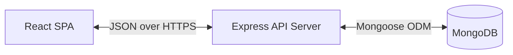

# Startup CRM Lite

<div align="center">
  
  
  <p>A lightweight, performant, and modern Customer Relationship Management system designed specifically for early-stage startups and small businesses.</p>

  <!-- Badges -->
  <a href="https://react.dev"></a>
  <a href="https://nodejs.org"></a>
  <a href="https://expressjs.com"></a>
  <a href="https://www.mongodb.com"></a>
  <a href="https://tailwindcss.com"></a>
  <a href="LICENSE"></a>
</div>

## Table of Contents
1. [Project Overview](#project-overview)
2. [Problem Statement](#problem-statement)
3. [Vision & Objectives](#vision--objectives)
4. [Key Features](#key-features)
5. [Target Users](#target-users)
6. [Use Cases](#use-cases)
7. [Business Value](#business-value)
8. [Screenshots](#screenshots)
9. [System Architecture](#system-architecture)
10. [Application Workflow](#application-workflow)
11. [End-to-End User Flow](#end-to-end-user-flow)
12. [Technology Stack](#technology-stack)
13. [Project Structure](#project-structure)
14. [Frontend Architecture](#frontend-architecture)
15. [Backend Architecture](#backend-architecture)
16. [Database Architecture](#database-architecture)
17. [API Overview](#api-overview)
18. [Authentication & Authorization](#authentication--authorization)
19. [State Management](#state-management)
20. [Security Considerations](#security-considerations)
21. [Development Prerequisites](#development-prerequisites)
22. [Installation Guide](#installation-guide)
23. [Environment Variables](#environment-variables)
24. [Running the Project](#running-the-project)
25. [Build Process](#build-process)
26. [CI/CD Overview](#cicd-overview)
27. [Testing Strategy](#testing-strategy)
28. [Debugging & Troubleshooting](#debugging--troubleshooting)
29. [Performance Optimizations](#performance-optimizations)
30. [Coding Standards](#coding-standards)
31. [Versioning Strategy & Roadmap](#versioning-strategy--roadmap)
32. [Contribution Guidelines](#contribution-guidelines)
33. [License & Credits](#license--credits)

---

## Project Overview
Startup CRM Lite is a full-stack, decoupled web application that provides a streamlined interface for managing leads, tracking conversions, and visualizing analytics. It is built with a React/Vite frontend and a Node.js/Express backend, backed by MongoDB. 

## Problem Statement
Traditional CRMs (like Salesforce or HubSpot) are often too complex, bloated, and expensive for early-stage startups that need a simple, fast, and intuitive way to track leads and measure sales performance without a steep learning curve.

## Vision & Objectives
To provide the fastest, most developer-friendly, and easy-to-use open-source CRM that can be deployed in minutes, offering essential lead management capabilities with zero unnecessary bloat.

## Key Features
- **Secure Authentication:** JWT-based user registration and login.
- **Lead Management:** Create, read, update, and delete (CRUD) sales leads.
- **Dashboard & Analytics:** Visual charts (via Recharts) displaying lead status and performance metrics.
- **Responsive UI:** Modern, mobile-first design powered by TailwindCSS v4.
- **Dark/Light Mode:** Integrated theme switching for user comfort.
- **Robust Security:** Backend protected against XSS, NoSQL Injection, and brute-force attacks via Helmet, express-mongo-sanitize, and rate-limiting.

## Target Users
- Founders and indie hackers managing early sales pipelines.
- Small business sales teams needing a lightweight tool.
- Developers looking for a clean, modern MERN stack boilerplace.

## Use Cases
1. **Sales Tracking:** A founder logs in, adds a new interested prospect as a lead, updates their status from "New" to "Contacted," and eventually marks them as "Converted."
2. **Performance Review:** A sales manager views the Analytics page to see the conversion rate and lead distribution across different stages.

## Business Value
Reduces the time-to-market for a sales tracking solution, lowers operational software costs to zero (open-source), and improves early-stage sales organization.

## Screenshots
> *[Placeholder for Dashboard Screenshot]*
> *[Placeholder for Leads Management Screenshot]*
> *[Placeholder for Analytics Screenshot]*

---

## System Architecture

### High-Level Architecture Overview
The application follows a standard decoupled Client-Server architecture (MERN stack).
- **Client (Frontend):** A Single Page Application (SPA) built with React 19 and Vite.
- **API (Backend):** A RESTful API built with Express 5 running on Node.js.
- **Database:** MongoDB (typically Atlas) used for persistent data storage.



### Application Workflow
1. Client requests the web application from the static host.
2. User authenticates via the API, receiving an HTTP-only/secure JWT (or standard JWT payload).
3. Client stores the token and includes it in the `Authorization` header for protected routes.
4. Client requests lead data; API queries MongoDB and returns JSON.
5. Client renders UI using React Context for global state.

### End-to-End User Flow
`Visit App` ➔ `Register/Login` ➔ `View Dashboard` ➔ `Navigate to Leads` ➔ `Add New Lead` ➔ `Update Status` ➔ `View Analytics` ➔ `Logout`

---

## Technology Stack

| Layer | Technology | Description |
|-------|------------|-------------|
| **Frontend** | React 19, Vite, React Router v7 | Fast, modern UI rendering and routing. |
| **Styling** | TailwindCSS v4, Lucide React | Utility-first styling and iconography. |
| **Charts** | Recharts | Composable charting library for React. |
| **Backend** | Node.js, Express 5 | Asynchronous server framework. |
| **Database** | MongoDB, Mongoose 9 | NoSQL database and Object Data Modeling. |
| **Security** | JWT, bcryptjs, Helmet, Rate Limit | Authentication and API hardening. |

---

## Project Structure

### Explanation of Every Major Folder

```text
startup-crm-lite/
├── backend/                # Express API Server
│   ├── config/             # Database connection & environment setups
│   ├── controllers/        # Business logic for API endpoints
│   ├── middleware/         # Custom Express middlewares (Auth, Error, Security)
│   ├── models/             # Mongoose schemas (User, Lead)
│   └── routes/             # API route definitions
├── src/                    # React Frontend
│   ├── assets/             # Static assets (images, icons)
│   ├── components/         # Reusable UI components (Buttons, Cards, Inputs)
│   ├── constants/          # Application-wide constants
│   ├── context/            # React Context providers (Auth, Theme, Leads)
│   ├── data/               # Mock data or data transformation utilities
│   ├── hooks/              # Custom React hooks
│   ├── pages/              # Route-level components (Dashboard, Login, Leads)
│   ├── routes/             # Frontend routing configuration
│   ├── services/           # API call abstractions (Axios configurations)
│   └── utils/              # Helper functions and formatters
└── public/                 # Public static files served by Vite
```

### Explanation of Every Important File
- `package.json` (Root): Defines frontend dependencies and Vite scripts.
- `backend/package.json`: Defines backend dependencies and Node.js scripts.
- `vite.config.js`: Configuration for the Vite build tool.
- `src/main.jsx`: React application entry point.
- `src/App.jsx`: Root component, sets up Providers (Theme, Lead, Auth) and Routing.
- `backend/server.js`: Entry point for the Express server, configures middlewares and mounts routes.
- `.env` & `backend/.env`: Environment variables for frontend and backend (ignored by Git).

---

## Frontend Architecture
The frontend is a React 19 Single Page Application. It uses functional components and hooks. Routing is handled by `react-router-dom` v7 with lazy loading for optimized bundle sizes. The UI is constructed using TailwindCSS utility classes directly in the JSX. 

## Backend Architecture
The backend is a monolithic REST API using Express. It follows a modular MVC-like pattern (Routes ➔ Controllers ➔ Models).
- **Routes** define the endpoints and attach middleware.
- **Controllers** handle request parsing, invoke Mongoose models, and format JSON responses.
- **Middleware** intercepts requests for Authentication, Input Validation, and Error Handling.

## Database Architecture
MongoDB is used as the document store. 
- **Users Collection:** Stores user credentials (passwords hashed via bcrypt).
- **Leads Collection:** Stores lead information (Name, Email, Status, Source, Company). Linked to Users via reference to ensure data isolation (multi-tenancy).

## API Overview
| Endpoint | Method | Description | Auth Required |
|----------|--------|-------------|---------------|
| `/api/auth/register` | POST | Register a new user | No |
| `/api/auth/login` | POST | Authenticate user and return JWT | No |
| `/api/leads` | GET | Retrieve all leads for current user | Yes |
| `/api/leads` | POST | Create a new lead | Yes |
| `/api/leads/:id` | PUT | Update an existing lead | Yes |
| `/api/leads/:id` | DELETE | Delete a lead | Yes |

## Authentication & Authorization
- **Authentication:** Handled via JSON Web Tokens (JWT). Upon successful login, the backend issues a signed token.
- **Authorization:** Protected API routes use an `auth` middleware that verifies the JWT from the request headers (`Authorization: Bearer <token>`) before allowing access to the controller.

## State Management
State is managed using React Context API to prevent prop drilling.
- `AuthContext`: Manages current user session and authentication status.
- `LeadContext`: Caches lead data, handles optimistic UI updates, and provides mutation functions.
- `ThemeContext`: Toggles between light and dark visual modes.

## Security Considerations
- **Password Hashing:** `bcryptjs` is used to salt and hash passwords.
- **NoSQL Injection Prevention:** `express-mongo-sanitize` strips out MongoDB operators (`$`, `.`) from request payloads.
- **HTTP Headers:** `helmet` secures Express apps by setting various HTTP headers.
- **Rate Limiting:** `express-rate-limit` prevents brute-force and DDoS attacks against the API.
- **CORS:** Configured to only allow requests from specific frontend origins.

---

## Development Prerequisites
- **Node.js**: v18.0.0 or higher
- **npm**: v9.0.0 or higher (or yarn/pnpm)
- **MongoDB**: Local instance or MongoDB Atlas cluster

## Installation Guide

1. **Clone the repository:**
   ```bash
   git clone <repository-url>
   cd startup-crm-lite
   ```

2. **Install Frontend Dependencies:**
   ```bash
   npm install
   ```

3. **Install Backend Dependencies:**
   ```bash
   cd backend
   npm install
   ```

## Environment Variables (".env") Documentation

You need two `.env` files. 

**1. Root Directory (`/.env`) - Frontend:**
```env
VITE_API_URL=http://localhost:5000/api
```

**2. Backend Directory (`/backend/.env`) - Server:**
```env
PORT=5000
NODE_ENV=development
MONGODB_URI=mongodb://localhost:27017/startup-crm
JWT_SECRET=your_super_secret_jwt_key_here
FRONTEND_URL=http://localhost:5173
```

## Running the Project (Development)

**Start the Backend API:**
```bash
cd backend
npm run dev
# Runs on http://localhost:5000 with Nodemon for hot-reloading
```

**Start the Frontend Client:**
```bash
# From the root directory
npm run dev
# Runs on http://localhost:5173 with Vite HMR
```

## Running the Project (Production) & Build Process
To build the frontend for production:
```bash
npm run build
```
This generates optimized static files in the `/dist` directory which can be served by Nginx, Vercel, or Netlify.

The backend can be started in production mode using:
```bash
cd backend
npm start
```

## CI/CD Overview
*(Currently minimal. Future implementation will include GitHub Actions to run ESLint, execute backend unit tests, and automatically deploy to Vercel (frontend) and Render (backend) upon pushing to the `main` branch.)*

## Testing Strategy
- **Backend:** Setup for unit and integration testing using Mocha/Chai or Jest against a dedicated test database (refer to `test-advanced.js` and `test-validation.js`).
- **Frontend:** Component testing can be introduced via Vitest and React Testing Library.

## Debugging Tips
- Check the browser network tab to ensure CORS isn't blocking requests.
- Verify that `VITE_API_URL` correctly points to the running backend port.
- Inspect the backend terminal for MongoDB connection errors or JWT validation failures.

## Performance Optimizations
- **Frontend:** Vite provides extremely fast HMR and optimized rollup builds. Lazy loading of React Router components ensures a small initial bundle size.
- **Backend:** Indexing on MongoDB (e.g., indexing leads by `user_id`) ensures fast query performance. Payload size limits (`10kb`) prevent server memory exhaustion.

## Coding Standards & Project Conventions
- **ESLint:** Configured for React hooks and standard JS rules.
- **Code Style:** Functional React components, async/await for asynchronous backend operations, and standard RESTful URI naming conventions.

## Versioning & Branching Strategy
- Semantic Versioning (`MAJOR.MINOR.PATCH`).
- Feature branches (`feature/add-dark-mode`) branching off `main`.
- Pull Requests required for merging into `main`.

## Contribution Guidelines
1. Fork the repository.
2. Create your feature branch (`git checkout -b feature/AmazingFeature`).
3. Commit your changes (`git commit -m 'Add some AmazingFeature'`).
4. Push to the branch (`git push origin feature/AmazingFeature`).
5. Open a Pull Request.

## Known Limitations
- Email verification and password reset flows are not yet implemented.
- Exporting leads to CSV is currently unsupported.

## Future Roadmap
- Implementation of WebSockets for real-time lead updates.
- Integration with third-party email providers (SendGrid/Mailgun).
- Advanced filtering and sorting on the Leads table.
- Comprehensive unit test coverage.

## License
Distributed under the ISC License. See `LICENSE` for more information.

## Credits & Acknowledgements
Built by Startup CRM Lite Contributors.
Special thanks to the open-source community, specifically the creators of React, Vite, Express, and TailwindCSS.

## Final Project Summary
Startup CRM Lite is the perfect starting point for developers aiming to build or extend a CRM system. With a rock-solid security foundation, a clean MERN architecture, and a modern frontend, it bridges the gap between complex enterprise software and simplistic spreadsheets.
